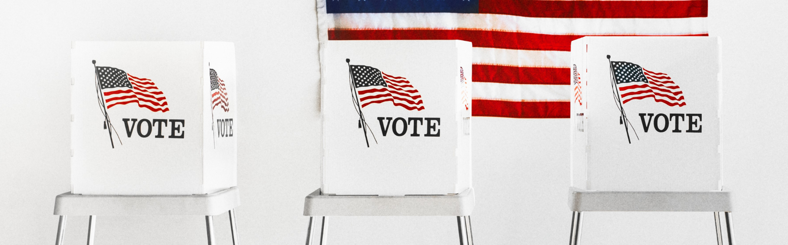
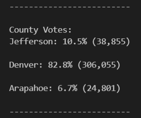
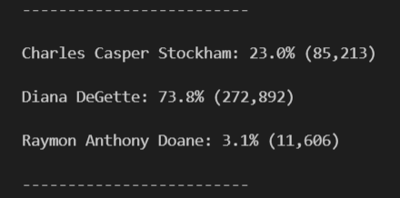
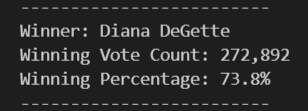

# Election Audit with Python



## <div align="center">Python app designed to audit county election results</div>

<p align="center">
<a href="#goals">Goals</a> &nbsp;&bull;&nbsp;
<a href="#dataset">Dataset</a> &nbsp;&bull;&nbsp;
<a href="#tools-used">Tools Used</a> &nbsp;&bull;&nbsp;
<a href="#analysis-and-challenges">Analysis and Challenges</a> &nbsp;&bull;&nbsp;
<a href="#results">Results</a> &nbsp;&bull;&nbsp;
<a href="#summary">Summary</a>
</p>

# <div align="center">Goals</div>
It's Election season! The local election commission needs our help auditing the results in a quick, efficient manner. Our solution is PyPoll, a Python program that automates the counting process of the audit. This program certifies the numbef of votes cast for each candidate, the winning candidate, and voter turnout per county. We're achieving this with PyPoll by processing a CSV file containing more than 369,000 rows of voting data, analyzing the votes, and generating a handy text file summarizing the results.


# <div align="center">Dataset</div>
This dataset contains all 369,712 ballots cast in a local county election.

- [Election Results:](data/election_results.csv) CSV File containing data for 369,712 votes, downloaded from an Amazon S3 server.

# <div align="center">Tools Used</div>
- **Python:** Programming language used to build app to automate election audit

# <div align="center">Analysis and Challenges</div>
- PyPoll determined that there were 369,711 total votes cast in this congressional election. We utilized the following for loop to tally the total vote count:
```
 # For each row in the CSV file, add to the total vote count
    for row in reader:
        total_votes = total_votes + 1
```

# <div align="center">Results</div>

- Below you'll see a breakdown of voter turnout in Jefferson, Arapahoe and Denver counties. For each county, you'll see where the percentage of total votes were cast, and the number of voter turnout.

   

- Denver County had the highest voter turnout, with 306,055 residents accounting for 83 percent of the total vote. Considering Denver is a major metropolitan area, this isn't much of a surprise.

- Our next breakdown outlines the number of votes cast per congressional candidate. Alongside you'll see the percentage of the total vote the candidate received, and the total number of votes cast for that candidate.

   
   
- The winner of the election was Diana DeGette, and it was not particularly close. She received 272,892 votes, which accounts for 74 percent of the total votes cast.

   

# <div align="center">Summary</div>
PyPoll is a versatile program that has many more layers of analysis to offer that we can implement for future elections. It would be relevant for the incumbent to study how many votes each candidate received in each county. Should she seek re-election, it's important to know which counties she did not to well in the previous election to determine a future campaign strategy. We can also use PyPoll to audit elections across the state for different campaigns, such as School Board, State Senate, or District Attorney. 

We can modify PyPoll with additional code to futher analyze this data set, and we can feed it an entirely different CSV file with election results from other state districts. There are endless possibilities! We are more than happy to help you realize your auditing goals across the board.

[Back to top](#election-audit-with-python)


